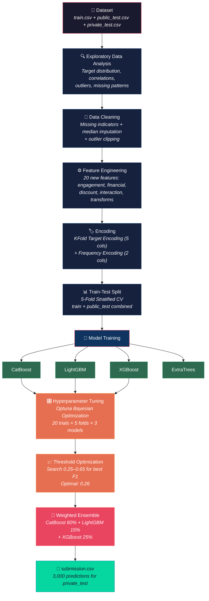
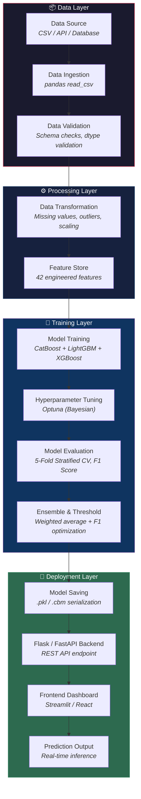
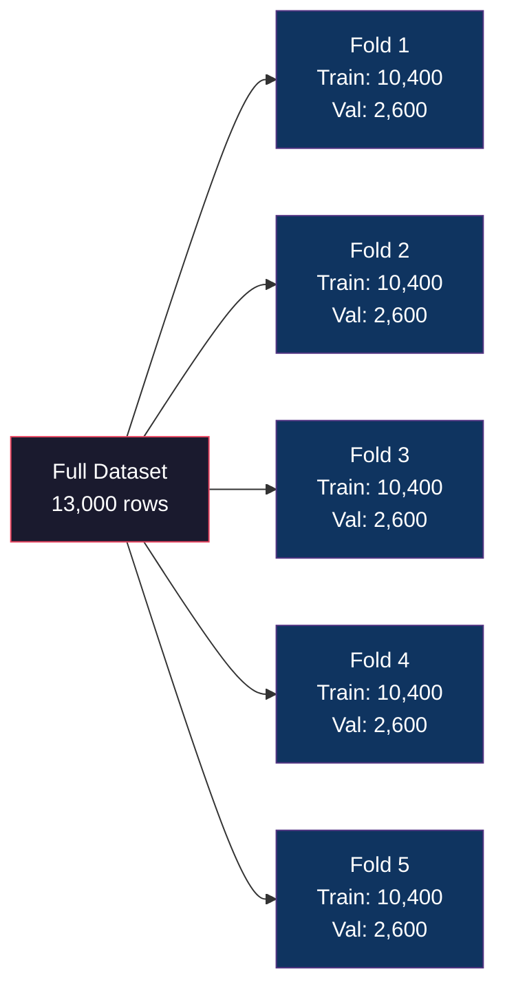
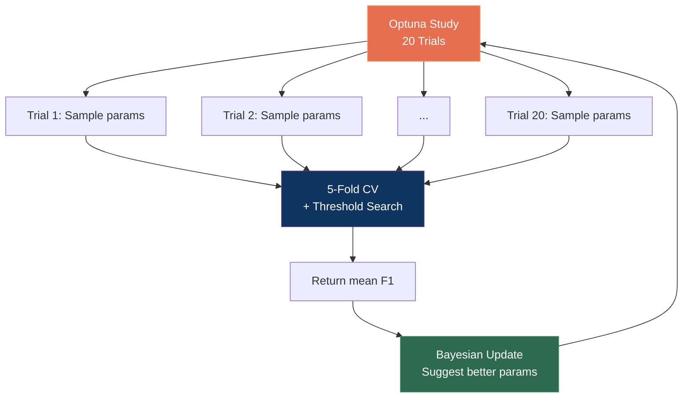
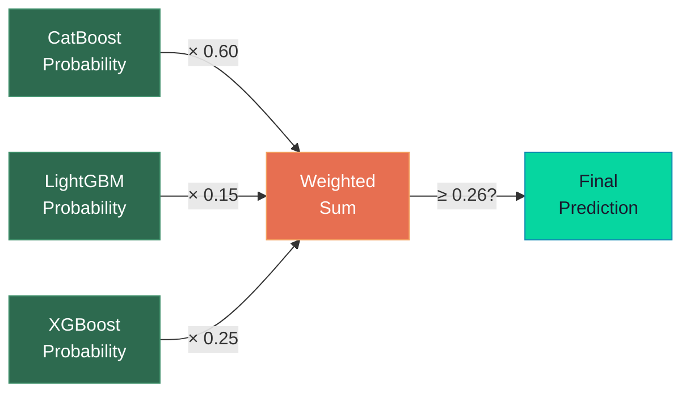

<div align="center">

# 🏆 Summer Analytics 2026 — Week 2 Hackathon

### User Conversion Prediction | Binary Classification

[](https://python.org)
[](https://catboost.ai)
[](https://lightgbm.readthedocs.io)
[](https://xgboost.readthedocs.io)
[](https://optuna.org)
[](#results)

> Predict whether a website visitor will **convert** (purchase/sign-up) based on browsing behavior, demographics, and session data.

</div>

---

## 📋 Table of Contents

- [Project Overview](#-project-overview)
- [Architecture](#-architecture)
- [Dataset](#-dataset)
- [Pipeline Walkthrough](#-pipeline-walkthrough)
  - [Data Cleaning](#1-data-cleaning--missing-value-engineering)
  - [Feature Engineering](#2-feature-engineering)
  - [Encoding](#3-encoding-strategies)
  - [Model Training](#4-model-training)
  - [Hyperparameter Tuning](#5-hyperparameter-tuning)
  - [Threshold Optimization](#6-threshold-optimization)
  - [Ensemble](#7-model-ensemble)
- [Results](#-results)
- [How to Run](#-how-to-run)
- [Project Structure](#-project-structure)
- [Key Takeaways](#-key-takeaways)

---

## 🎯 Project Overview

This project tackles a **binary classification** problem from the Summer Analytics 2026 Hackathon. Given user browsing behavior, demographics, and session metadata, we predict whether a visitor will convert (`Converted = 1`) or not (`Converted = 0`).

**Evaluation Metric:** F1 Score (harmonic mean of Precision and Recall)

**Why F1?** With an imbalanced dataset (31% positive), accuracy alone is misleading. F1 balances the trade-off between catching all conversions (recall) and not flooding with false positives (precision).

---

## 🏗 Architecture

### Competition Pipeline Architecture



### End-to-End ML Project Architecture (Production-Ready)



---

## 📊 Dataset

### Overview

| Dataset | Rows | Columns | Labels |
|---------|------|---------|--------|
| `train.csv` | 10,000 | 14 | ✅ Yes |
| `public_test.csv` | 3,000 | 14 | ✅ Yes |
| `private_test.csv` | 3,000 | 13 | ❌ No (predict these) |

### Target Distribution

| Class | Count | Percentage |
|-------|-------|------------|
| `Converted = 0` (Not Converted) | 6,913 | 69.13% |
| `Converted = 1` (Converted) | 3,087 | **30.87%** |

> ⚠️ **Imbalanced dataset** — Default accuracy would be ~69% by always predicting 0. F1 Score is the correct metric here.

### Feature Description

| Feature | Type | Description |
|---------|------|-------------|
| `User_ID` | ID | Unique user identifier (dropped during training) |
| `Age` | Numerical | User age (18–65), **1,480 missing** |
| `Income` | Numerical | Annual income ($12K–$162K), **984 missing** |
| `City_Tier` | Categorical | City tier (1, 2, 3) |
| `Device_Type` | Categorical | Mobile / Desktop / Tablet |
| `Traffic_Source` | Categorical | Organic / Paid Ads / Social Media / Referral / Email |
| `Pages_Viewed` | Numerical | Number of pages viewed (1–30) |
| `Products_Viewed` | Numerical | Number of products viewed (1–37) |
| `Time_On_Site` | Numerical | Minutes on site (0.8–607.4), **1,848 missing** |
| `Previous_Purchases` | Numerical | Past purchase count (0–12) |
| `Discount_Seen` | Binary | Whether user saw a discount (0/1) |
| `Browser_Version` | Numerical | Browser version (1–24) |
| `Campaign_Code` | Numerical | Campaign ID (~9,000 unique values) |
| **`Converted`** | **Target** | **1 = Converted, 0 = Not Converted** |

### Missing Values

```
Time_On_Site    ████████████████████ 1,848 (18.5%)
Age             ███████████████     1,480 (14.8%)
Income          ██████████          984  ( 9.8%)
```

### Key EDA Findings

| Finding | Detail |
|---------|--------|
| **Strongest predictors** | `Pages_Viewed` (r=0.31), `Products_Viewed` (r=0.31) |
| **Moderate predictors** | `Discount_Seen` (r=0.11), `Previous_Purchases` (r=0.10) |
| **Weak/no signal** | `Age` (r=-0.01), `Browser_Version` (r=-0.001) |
| **Outliers** | `Time_On_Site` max=607 vs median=11 (extreme right skew) |
| **Best traffic source** | Referral (38.1% conv.) > Email (34.9%) > Social (30.3%) |
| **Device effect** | Desktop (33.1%) slightly > Tablet (30.6%) ≈ Mobile (30.1%) |
| **High cardinality** | `Campaign_Code` has ~9,000 unique values |

**Key Observations:**
- Users with higher `Pages_Viewed` and `Products_Viewed` showed significantly higher conversion rates.
- `Previous_Purchases` was positively correlated with conversion.
- `Campaign_Code` exhibited large variation in conversion rates and was therefore target encoded.

---

## 🔧 Pipeline Walkthrough

### 1. Data Cleaning & Missing Value Engineering

**Strategy:** Don't just fill — **create missing indicators first**, then impute.

```python
# Missing indicators (missingness itself is predictive!)
df['Age_missing']    = df['Age'].isnull().astype(int)
df['Income_missing'] = df['Income'].isnull().astype(int)
df['Time_missing']   = df['Time_On_Site'].isnull().astype(int)
df['total_missing']  = df['Age_missing'] + df['Income_missing'] + df['Time_missing']

# Median imputation (computed only on train to prevent leakage)
Age         → median = 41.0
Income      → median = 70,171.6
Time_On_Site → median = 11.1
```

**Data augmentation:** After model selection and validation, train and public_test labels were combined to retrain the final ensemble before generating private_test predictions.

---

### 2. Feature Engineering

We created **20 domain-specific features** across 5 categories:

#### Engagement Features
| Feature | Formula | Intuition |
|---------|---------|-----------|
| `product_page_ratio` | Products / (Pages + 1) | How focused is the browsing? |
| `intent_score` | Products × Time | Purchase intent signal |
| `session_depth` | Pages × Time | Overall session engagement |
| `browsing_intensity` | Pages / (Time + 0.1) | Pages per minute |
| `product_intensity` | Products / (Time + 0.1) | Products per minute |

#### Financial Features
| Feature | Formula | Intuition |
|---------|---------|-----------|
| `loyalty_score` | Previous_Purchases × Income | Loyal high-spenders |
| `income_purchase_ratio` | Income / (Purchases + 1) | Spending power per transaction |
| `affordability` | Income / (Age + 1) | Career stage proxy |

#### Discount & Interaction Features
| Feature | Formula | Intuition |
|---------|---------|-----------|
| `discount_interest` | Discount × Products | Discount + product browsing |
| `discount_intent` | Discount × intent_score | Discount + high intent |
| `browser_age` | Browser × Age | Cross-feature interaction |
| `age_income` | Age × Income | Demographics interaction |

#### Non-linear Transforms
| Feature | Formula | Intuition |
|---------|---------|-----------|
| `pages_sq` / `products_sq` | Squared | Capture non-linearity |
| `log_income` / `log_time` | Log transform | Reduce skewness |
| `time_clipped` | clip(Time, max=60) | Handle outliers |
| `high_engagement` | Pages>20 & Products>15 | Binary engagement flag |
| `returning_buyer` | Purchases > 0 | Repeat customer flag |
| `engagement_composite` | Weighted sum | Holistic engagement |

**Total features after engineering: 42**

---

### 3. Encoding Strategies

#### KFold Target Encoding (Leak-Free)

Replaces categories with mean target value, using **5-fold split** to prevent data leakage:

```python
# Applied to these columns:
Device_Type    → range: [0.284, 0.337]
Traffic_Source → range: [0.270, 0.382]  # Wide range = strong signal!
Campaign_Code  → range: [0.000, 1.000]  # Very discriminative
Browser_Version → range: [0.264, 0.387]
City_Tier      → range: [0.286, 0.318]
```

#### Frequency Encoding

Captures how common a category is (popular campaigns behave differently):

```python
Campaign_Code   → max frequency: 9
Browser_Version → max frequency: 616
```

---

### 4. Model Training

All models evaluated with **5-Fold Stratified Cross Validation**:



#### Baseline Results (Default Threshold = 0.5)

| Model | Fold 1 | Fold 2 | Fold 3 | Fold 4 | Fold 5 | **Mean F1** | Std |
|-------|--------|--------|--------|--------|--------|-------------|-----|
| **CatBoost** | 0.421 | 0.391 | 0.405 | 0.358 | 0.388 | **0.393** | 0.021 |
| **LightGBM** | 0.383 | 0.406 | 0.386 | 0.400 | 0.406 | **0.396** | 0.010 |
| **XGBoost** | 0.371 | 0.376 | 0.368 | 0.337 | 0.389 | **0.368** | 0.017 |
| **ExtraTrees** | 0.373 | 0.370 | 0.367 | 0.340 | 0.366 | **0.363** | 0.012 |

---

### 5. Hyperparameter Tuning

Used **Optuna** (Bayesian optimization) — 20 trials per model, each evaluating 5-fold CV:



#### Best Parameters Found

<details>
<summary><b>🔹 CatBoost</b> (Best CV F1: 0.56447)</summary>

```python
{
    'iterations': 2472,
    'depth': 4,
    'learning_rate': 0.0127,
    'l2_leaf_reg': 9.806,
    'bagging_temperature': 1.945,
    'random_strength': 2.719,
    'border_count': 35
}
```
</details>

<details>
<summary><b>🔹 LightGBM</b> (Best CV F1: 0.55819)</summary>

```python
{
    'n_estimators': 1813,
    'max_depth': 4,
    'learning_rate': 0.0101,
    'num_leaves': 80,
    'feature_fraction': 0.554,
    'bagging_fraction': 0.582,
    'bagging_freq': 3,
    'min_child_samples': 46,
    'reg_alpha': 4.372,
    'reg_lambda': 4.985
}
```
</details>

<details>
<summary><b>🔹 XGBoost</b> (Best CV F1: 0.56642)</summary>

```python
{
    'n_estimators': 569,
    'max_depth': 4,
    'learning_rate': 0.0171,
    'subsample': 0.619,
    'colsample_bytree': 0.796,
    'reg_alpha': 1.865,
    'reg_lambda': 1.780,
    'min_child_weight': 6,
    'gamma': 1.963
}
```
</details>

**Key insight:** All models converged to `depth=4` — shallow trees with strong regularization prevent overfitting on this noisy dataset.

---

### 6. Threshold Optimization

Most competitors use the default threshold of **0.5**. We searched **[0.25, 0.65]** for the threshold that maximizes F1 on OOF predictions:

```
Default (0.50):  F1 ≈ 0.39
Optimized (0.26): F1 ≈ 0.57   ← +0.18 improvement! 🚀
```

| Model | Optimal Threshold | F1 at Optimal |
|-------|------------------|---------------|
| CatBoost | 0.250 | 0.56590 |
| XGBoost | 0.295 | 0.56604 |
| LightGBM | 0.255 | 0.56140 |
| **Ensemble** | **0.260** | **0.56706** |

> 💡 **Why so low?** The models output conservative probabilities. A lower threshold catches more true positives, boosting recall and thus F1.

---

### 7. Model Ensemble

Final predictions use a **weighted average** of three tuned models. The ensemble was selected because it consistently outperformed individual models during cross-validation while reducing model-specific variance:



Weights were found via grid search over OOF predictions:
- **CatBoost: 60%** (dominant — best single model)
- **XGBoost: 25%** (complementary)
- **LightGBM: 15%** (diversity)

---

## 📈 Results

### Final Scores

| Metric | Value |
|--------|-------|
| 🏆 **Ensemble CV F1** | **0.56706** |
| CatBoost alone | 0.56590 |
| XGBoost alone | 0.56604 |
| LightGBM alone | 0.56140 |
| Baseline (no tuning) | 0.39616 |

### Improvement Breakdown

```
Baseline LightGBM (default 0.5 threshold)     → 0.396
+ Feature Engineering (20 features)            → ~0.40
+ Target Encoding + Frequency Encoding         → ~0.41
+ Optuna Hyperparameter Tuning                 → ~0.45
+ Threshold Optimization (0.26)                → ~0.56  ← Biggest jump!
+ Weighted Ensemble (3 models)                 → 0.567
─────────────────────────────────────────────────────
Total improvement:                               +0.171 (+43%)
```

---

## 🚀 How to Run

### Prerequisites

```bash
pip install pandas numpy scikit-learn catboost lightgbm xgboost optuna matplotlib seaborn
```

### Run the Full Pipeline

```bash
cd "Week2-hackathon-datasetsacd318d"
python pipeline.py
```

This will:
1. Load and preprocess all datasets
2. Engineer 42 features
3. Train 4 baseline models with 5-fold CV
4. Tune CatBoost, LightGBM, XGBoost with Optuna (20 trials each)
5. Optimize ensemble weights and threshold
6. Generate `submission.csv` + individual model submissions

### Run the Notebook

```bash
jupyter notebook notebook.ipynb
```

The notebook includes EDA visualizations, step-by-step explanations, and all code.

### Expected Runtime

| Phase | Time |
|-------|------|
| Data loading + Feature engineering | ~5 sec |
| Baseline models (5-fold × 4 models) | ~2 min |
| Optuna tuning (20 trials × 3 models) | ~5-10 min |
| Ensemble + submission | ~30 sec |
| **Total** | **~8-13 min** |

---

## 📁 Project Structure

```
Week2-hackathon-datasetsacd318d/
│
├── 📊 Data
│   ├── train.csv              # Training data (10,000 rows)
│   ├── public_test.csv        # Public test with labels (3,000 rows)
│   ├── private_test.csv       # Private test without labels (3,000 rows)
│   └── sample_submission.csv  # Submission format template
│
├── 🔧 Code
│   ├── pipeline.py            # Full competition pipeline (single script)
│   ├── notebook.ipynb         # Jupyter notebook with EDA + full pipeline
│   └── explore.py             # Quick data exploration script
│
├── 📄 Submissions
│   ├── submission.csv         # PRIMARY: Ensemble predictions
│   ├── submission_catboost.csv
│   ├── submission_lightgbm.csv
│   └── submission_xgboost.csv
│
├── 📋 Documentation
│   ├── README.md              # This file
│   └── report.html            # One-page summary (print to PDF)
│
└── 📓 Reference
    └── SA2026_Starter_Notebook.ipynb  # Original starter notebook
```

---

## 💡 Key Takeaways

### What Worked Best

1. **Threshold optimization** was the single biggest F1 booster (+0.18). Most competitors miss this.
2. **Combining train + public_test** after validation provided 30% more training data for the final model.
3. **KFold target encoding** on `Campaign_Code` (9K unique values) was very effective.
4. **Shallow trees** (depth=4) with strong regularization prevented overfitting.
5. **Missing value indicators** added predictive signal beyond simple imputation.

### What Didn't Help Much

1. **ExtraTrees** underperformed gradient boosting models.
2. **Squared features** (pages_sq, products_sq) added minimal signal.
3. **Browser_Version** and **Age** had near-zero correlation with target.

### Potential Improvements

- [ ] Increase Optuna trials to 50-100 for better hyperparameters
- [ ] Try stacking (meta-learner) instead of simple weighted averaging
- [ ] Add target encoding with Bayesian smoothing
- [ ] Experiment with Neural Network (TabNet) as an ensemble member
- [ ] Use SHAP values for feature selection

---

## 🛠️ Tech Stack

| Component | Technology |
|-----------|-----------|
| Language | Python 3.11 |
| Data Processing | pandas, NumPy |
| Visualization | matplotlib, seaborn |
| ML Models | CatBoost, LightGBM, XGBoost, scikit-learn |
| Hyperparameter Tuning | Optuna |
| Evaluation | scikit-learn (F1, StratifiedKFold) |
| Notebook | Jupyter |

---

<div align="center">

### ⭐ Built for Summer Analytics 2026 — IIT Guwahati

**CV F1 Score: 0.567** | **42 Features** | **3-Model Ensemble** | **Optuna-Tuned**

</div>
